# PGP utilizando Mailvelope

    

## ¿Qué es PGP?
PGP es programa que sirve para cifrar y descifrar datos, de tal forma que solo el destinatario legítimo pueda descifrar la información. OpenPGP es el estándar abierto basado en PGP, y el que actualmente se utiliza en todos los programas. Mailvelope es una extensión para Chrome y Firefox que nos va a permitir cifrar y descifrar e-mails de los principales proveedores como Gmail, Outlook y Yahoo Mail.

## ¿Qué es Mailvelope?
Es una extensión para los navegadores Google Chrome y Mozilla Firefox que es totalmente gratuita, incorpora el estándar OpenPGP para el cifrado y descifrado de texto en los correos electrónicos, pero es que además permite cifrar los archivos adjuntos de dichos e-mails. Su utilización es muy sencilla si antes has usado algún programa basado en PGP para enviar y recibir correos electrónicos, hoy en RedesZone os vamos a enseñar cómo se configura y cómo se envían los e-mails cifrados para que nadie los lea.

---

## Tabla de contenido
1. Instalación de Mailvelope.
    - Adición extensión de navegador.
    - Configuración.
    - Generación clave pública y privada.
    - Verificación clave pública y privada.
	
2. Aplicación de Mailvelope para envío de correos.
    - Agregar contacto por importación.
    - Envío de correo firmado.
    - Recepción de correo firmado.
	- Descifrar el correo.
---

## 1. Instalación de Mailvelope

- Abrir en el navegador la página web de Mailvelope y descargar la extensión:
https://mailvelope.com/en

- Instalar la extensión en el navegador.

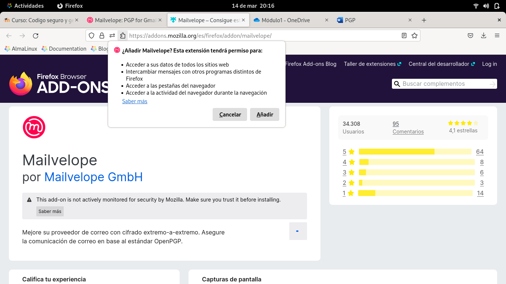

- Utilizar el ícono de la extensión de Mailvelope, en el navegador, para ingresar.

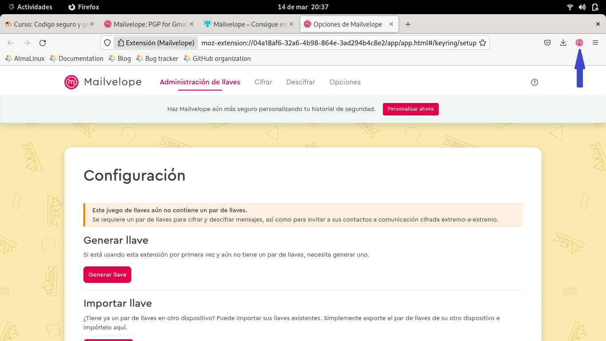

- Utilizar el botón "Generar llave" para configurar la llave pública y privada.

- Colocar el nombre de la llave, correo electrónico y contraseña.

- Aparecerá un aviso de generación de llave, esperar unos segundos...

- Una vez finalizado el proceso, aparecerá un mensaje de confirmación y la llave aparecerá en el listado.

- Cuando se crea una llave, se puede utilizar la opción "Avanzado" para definir el tipo de algoritmo encriptación, el tamaño de la llave y la fecha de caducidad de la misma.

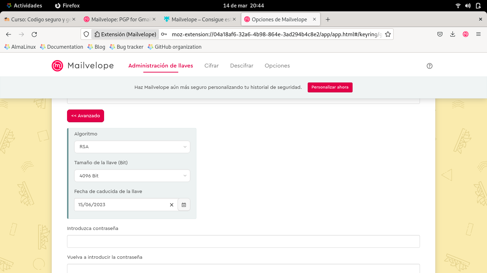

- Desde el listado de claves disponible, se puede ver el datalle de cada una si se hace clic sobre la misma.

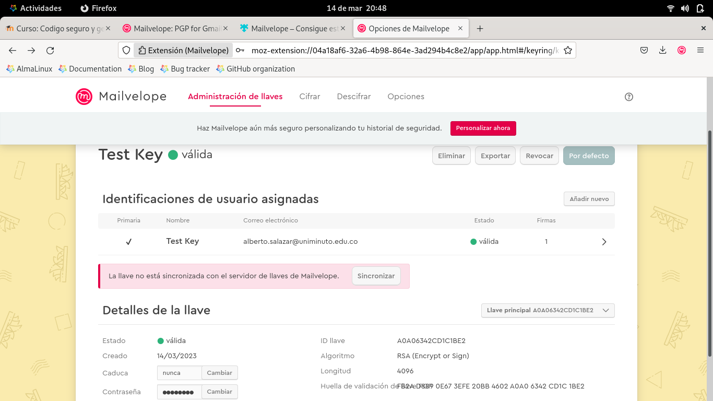

## 2. Aplicación de Mailvelope para envío de correos.

- Se puede exportar una llave para el envío e integración como contacto, en otro navegador.

- Utilizar la opción importar contactos, para agregar un archivo llave .asc

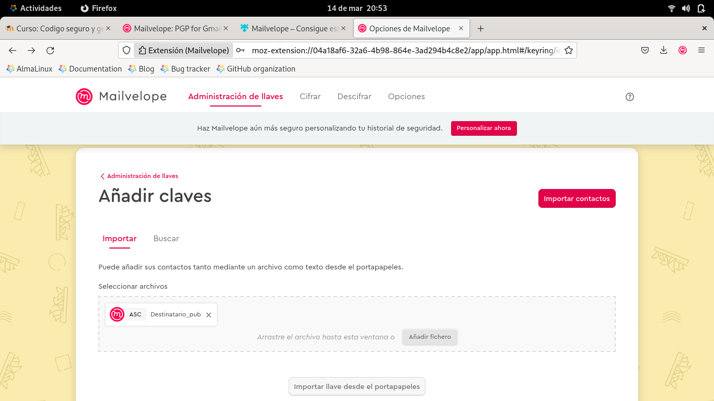

- Se muestra los datos del contacto contenido en la llave que se está importando.

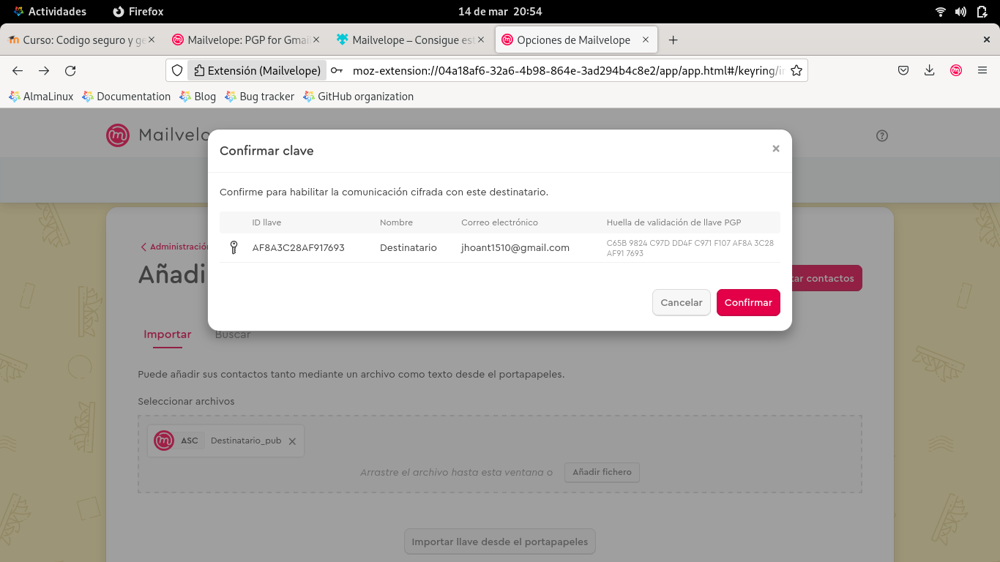

- Se puede verificar una llave por confirmación en el correo, donde con la clave se puede visualizar.

- Abrir en el navegador una cuenta de correo Gmail y utilizar el ícono de Mailvelope al lado de la opción Redactar.

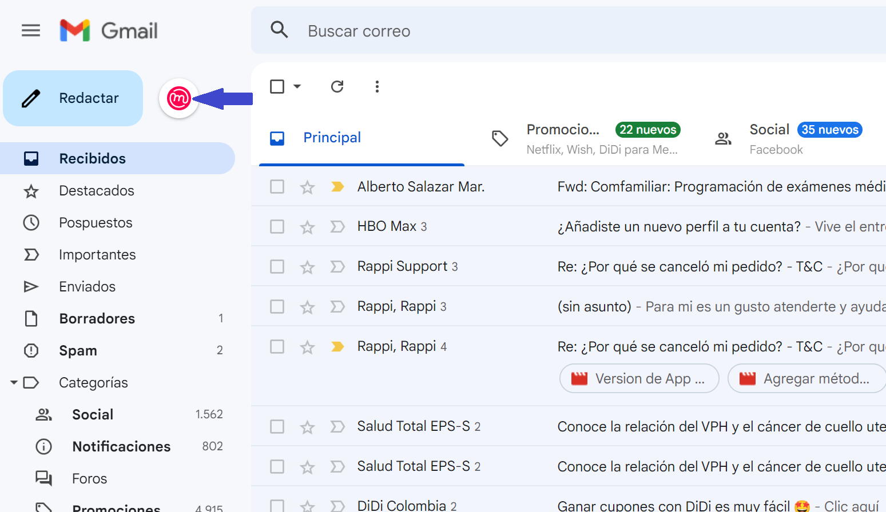

- Aparecerá una ventana emergente para agregar el contacto importado, un asunto y un mensaje.

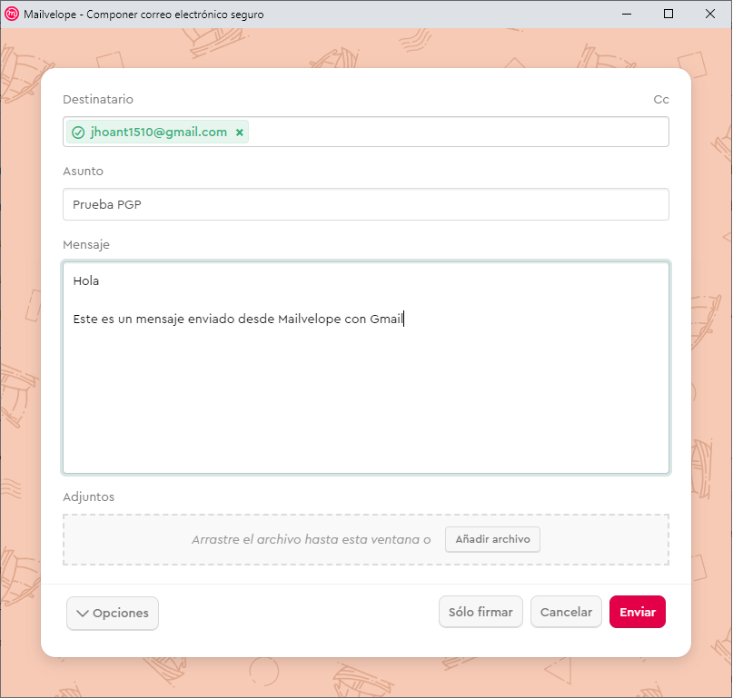

- Con el botón Opciones, se puede validar la llave que firmará el correo o agregar más llaves si se requiere.

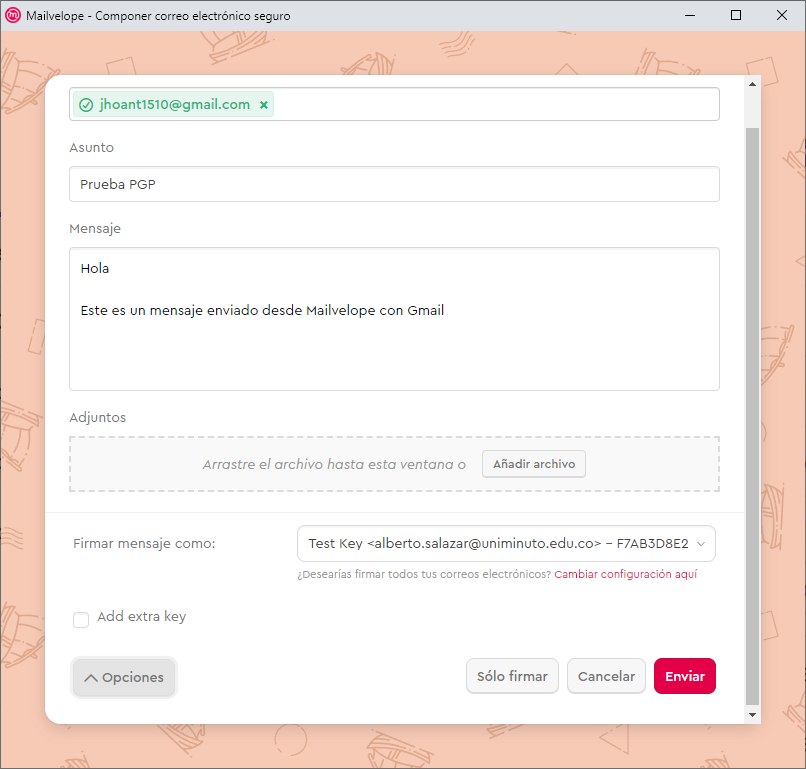

- Al enviar el correo aparecerá la casilla para ingresar la contraseña de la clave, la cual se deberá digitar y al enviar, aparecerá un mensaje de confirmación.

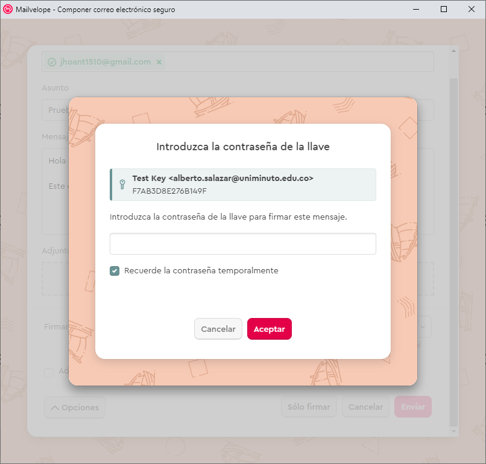

- Al receptor del mensaje, le llegara un correo con contenido encriptado.

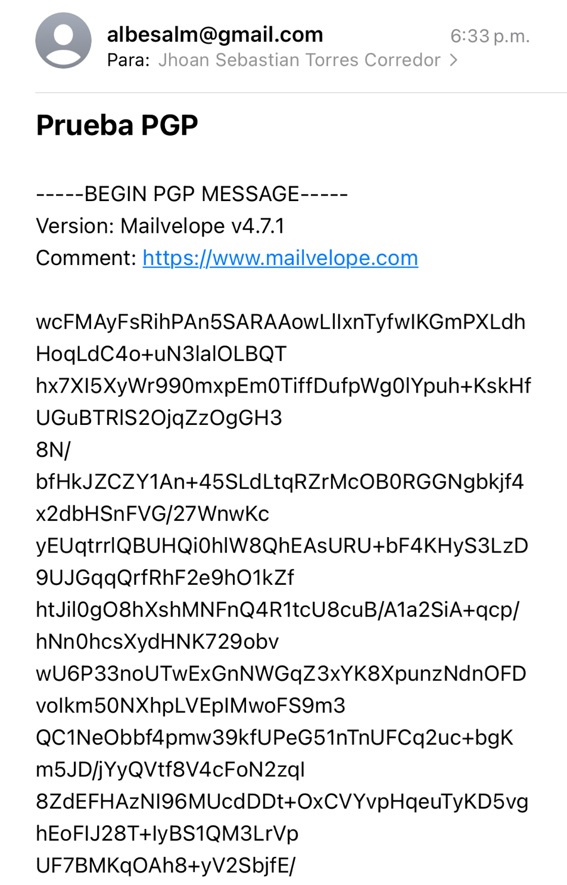