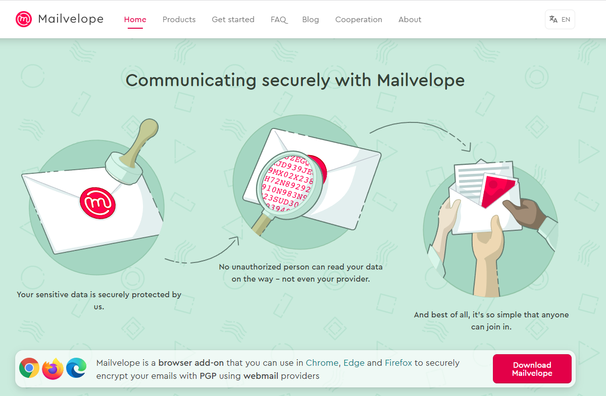
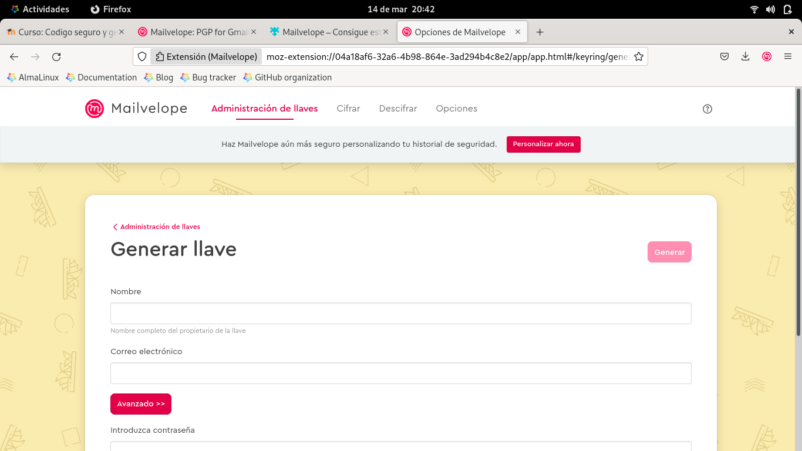
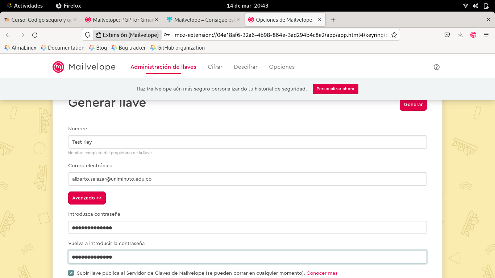
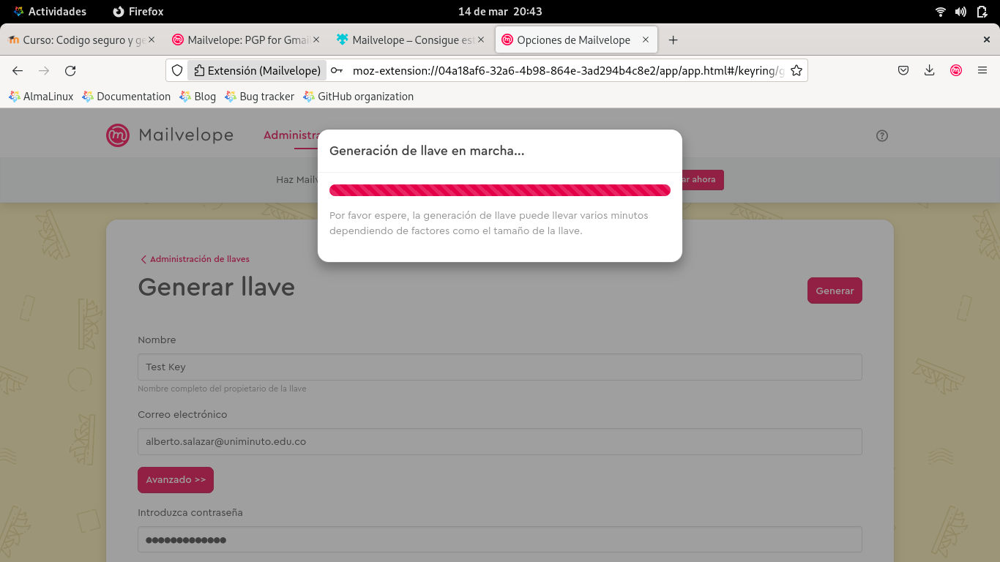
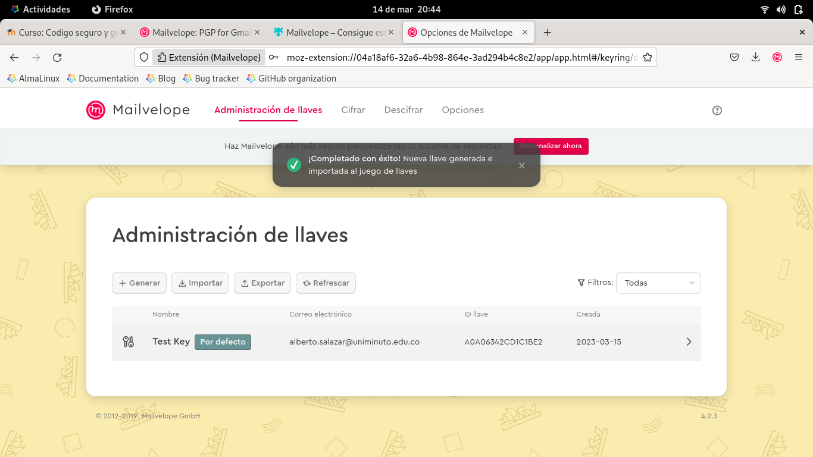
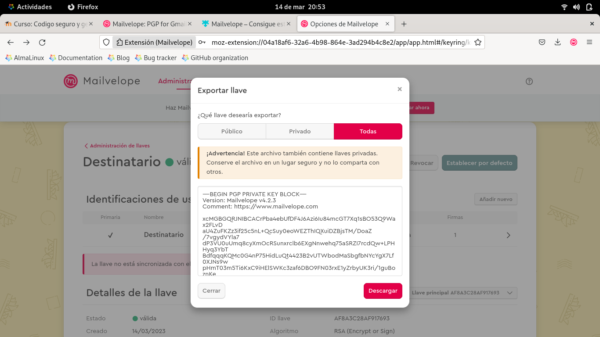
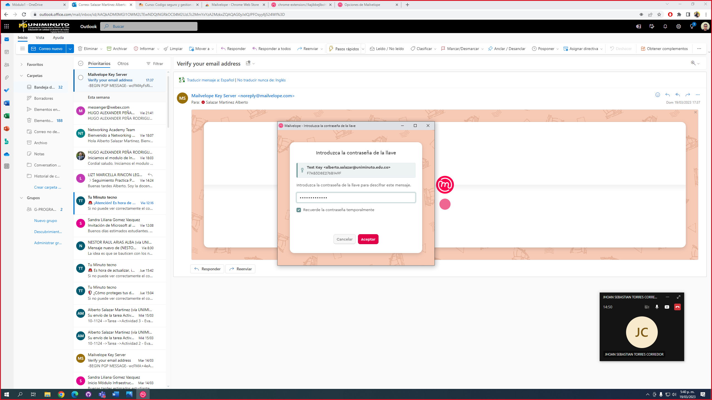

# PGP utilizando Mailvelope

    

## ¿Qué es PGP?
PGP es programa que sirve para cifrar y descifrar datos, de tal forma que solo el destinatario legítimo pueda descifrar la información. OpenPGP es el estándar abierto basado en PGP, y el que actualmente se utiliza en todos los programas. Mailvelope es una extensión para Chrome y Firefox que nos va a permitir cifrar y descifrar e-mails de los principales proveedores como Gmail, Outlook y Yahoo Mail.

## ¿Qué es Mailvelope?
Es una extensión para los navegadores Google Chrome y Mozilla Firefox que es totalmente gratuita, incorpora el estándar OpenPGP para el cifrado y descifrado de texto en los correos electrónicos, pero es que además permite cifrar los archivos adjuntos de dichos e-mails. Su utilización es muy sencilla si antes has usado algún programa basado en PGP para enviar y recibir correos electrónicos, hoy en RedesZone os vamos a enseñar cómo se configura y cómo se envían los e-mails cifrados para que nadie los lea.

---

## Tabla de contenido
1. Instalación de Mailvelope.
    - Adición extensión de navegador.
    - Configuración.
    - Generación clave pública y privada.
    - Verificación clave pública y privada.
	
2. Uso de Mailvelope.
    - Agregar contacto por importación.
    - Envío de correo firmado.
    - Recepción de correo firmado.
---

## Instalación de Mailvelope
- Abrir en el navegador la página web de Mailvelope y descargar la extensión:
https://mailvelope.com/en

